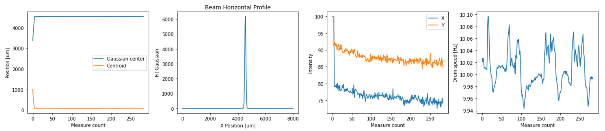

## Thor Labs Beam Profiler 209 Interface



This library is to help interface with the Thor Labs Beam Profiler model 209 in Python. This was quite a nightmare to get working, which is why the final result is a little more complicated than one might hope for, but it seems to work pretty reliably at this point.

Thor Labs provides several interfaces for their products, but the documentation is pretty lacking, especially on what the requirements for using these libraries are. They provide several .NET libraries to interface with the device, but I cannot seem to get any of the 64-bit versions of these libraries to work (in either pythonnet or native C#). The 32-bit work just fine, but unfortunately pythonnet cannot make use of both 32-bit and 64-bit assemblies at the same time, and I have several other dependencies that require 64-bit. Forunately (if one can call it that) 32-bit C# programs can run on a 64-bit system, which allows the following solution to work:

1. Utilize the 32-bit TLBP2 library in a C# program built for x86 architecture (which runs on 64 bit systems)
2. Create a local server in C#, connected to (64-bit) Python via a named pipe
3. Send a message from Python whenever a measurement is needed, and communicate the results back via the same pipe

While not exactly the most elegant solution, I have wrapped the code in a way that it *looks* like a native python library, when in reality it is really just a client communicating with a C# server. This structure does make changing settings on the beam profiler a little convoluted, but it is certainly still possible by editing the C# source.

I have included the C# source code in the `CSServer` directory, which is also where the executable is called from.

For example usage, see the `BeamProfilerExample` notebook in the root directory of the repo.

### Requirements

- 64-bit Python (I used v3.8, but any >3 should be fine)
- pywin32 (for creating the pipe)
- .NET Desktop Runtime v3.1 x86

### Usage

See the `Example` notebook for actual code, but the library can be used as you would expect any other interface.

First, you create the device object and connect to the device:

```
bp2Device = TLBP2()

bp2Device.connect()
```

You don't need to provide any information about the port/connection info; so long as the manufacturer software can detect the device, this library will be able to as well. Not that connecting will also spin up the internal drum, which may take up to 10 seconds (it will hang until this is complete).

From here, you can take measurements:

```
measurement = bp2Device.getMeasurement()
```

The `measurement` object will be a dictionary with the following keys:

- `centroid`
- `peak`
- `peak_intensity`
- `drum_speed`
- `beam_width`
- `gaussian_fit_parameters_x`
- `gaussian_fit_parameters_y`

Items with two values are formatted as (x, y) and the gaussian fit parameters are formated as (center, width, amplitude, fit percent).

You can disconnect from the device (which will also turn off the internal drum):

```
bp2Device.disconnect()
```

### Further Reading

1. [TLBP Product Page](https://www.thorlabs.com/newgrouppage9.cfm?objectgroup_id=804)
2. [Software Downloads Page](https://www.thorlabs.com/software_pages/ViewSoftwarePage.cfm?Code=Beam)
